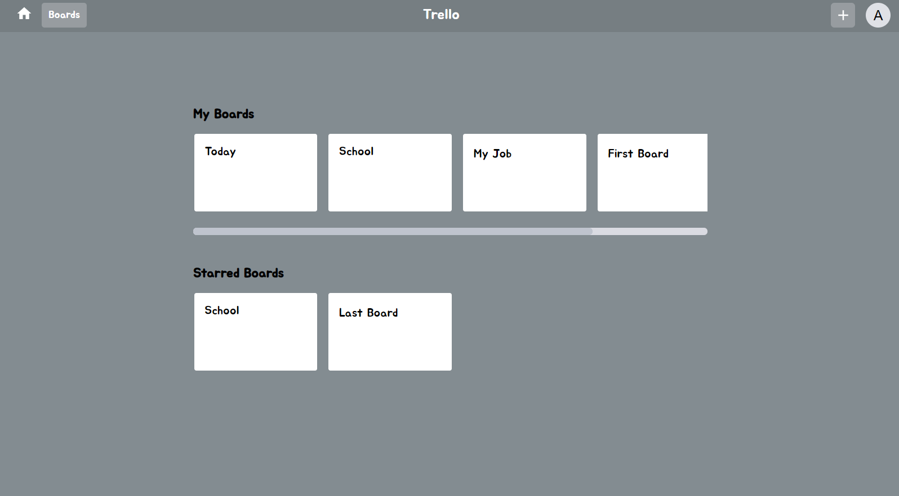
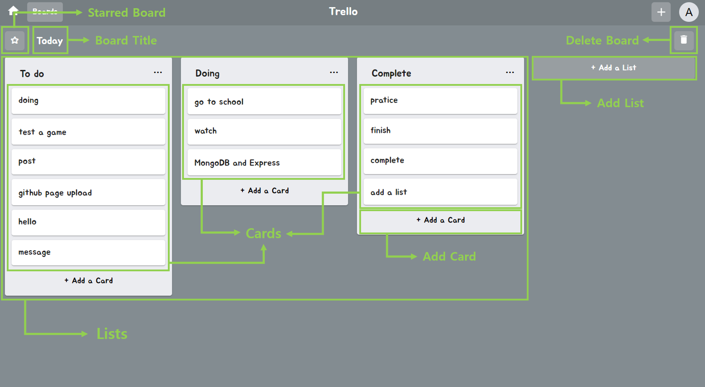
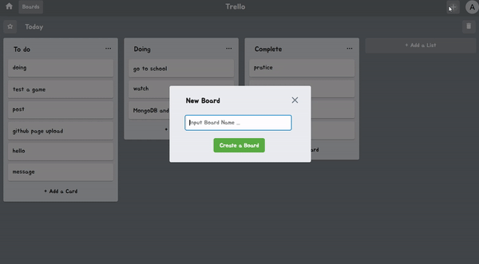
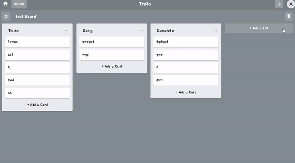
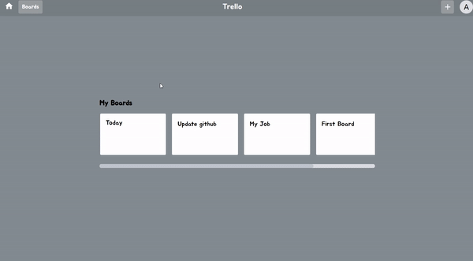
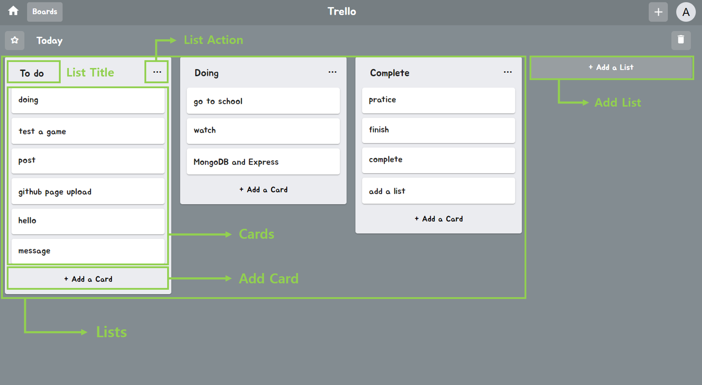
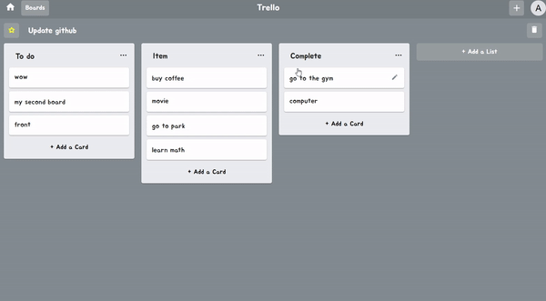
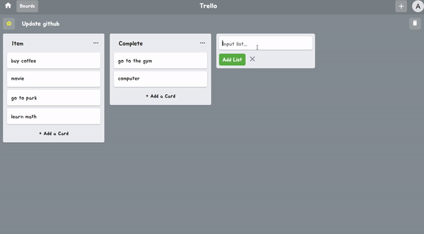
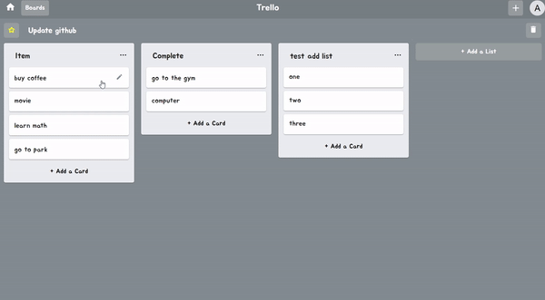
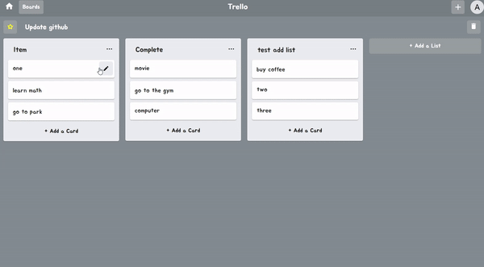

# Trello

- https://zeroaan.github.io/trello/
- 기간 : 20년 11월 11일 ~ 11월 25일
- 소개 : React, Typescript, Redux를 이용해 Trello를 만들어 보았다.
  <br />

- Redux를 통해 Trello의 Board, List, Card를 모두 관리하였고, Drag & Drop 기능을 구현하여 List 간의 Card 이동이 가능하게 하였다. 또한 css in js를 해보기 위해 material-ui와 styled-components를 사용해 컴포넌트 스타일링을 해보았다.

<br />

### Trello, TrelloBoards



- Trello component는 루트 페이지로 접속시 보이는 첫 페이지이다.
- 현재 가지고 있는 모든 Board들을 볼 수 있으며, 즐겨찾는 Board로 지정해놓은 Starred Boards들도 따로 확인할 수 있다.

```tsx
const { boards } = useSelector<RootState, BoardState>((state: RootState) => state.trello);

const AllBoards = () => {
  return (
    <DivBoard>
      {boards.map((v, i) => (
        <DivBoardLink key={i} to={`/board/${v.id}`}>
          <DivBoardBox>{v.boardName}</DivBoardBox>
        </DivBoardLink>
      ))}
    </DivBoard>
  );
};

const StarBoards = () => {
  return (
    <DivBoard>
      {boards.map((v, i) => {
        if (v.star === true) {
          return (
            <DivBoardLink key={i} to={`/board/${v.id}`}>
              <DivBoardBox>{v.boardName}</DivBoardBox>
            </DivBoardLink>
          );
        } else {
          return null;
        }
      })}
    </DivBoard>
  );
};
```

<br />

### Navbar

- 모든 페이지에서 볼 수 있는 Navbar로 상단에 위치해 있다.
- 좌측에는 현재 Board들을 볼 수 있는 메인페이지로 이동할 수 있는 버튼과 우측에는 새로운 Board를 생성할 수 있는 버튼이 있다.

<br />

### Board

- Trello 컴포넌트에서 하나의 Board를 클릭하면 볼 수 있는 페이지이다.
- trello의 기능인 List와 Card 생성, 수정, 삭제 등 Board 관리를 할 수 있다.



<br />

### BoardCreate

- 새로운 Board를 생성할 수 있다.


<br />

##### components/BoardCreate.tsx

- newBoard Text를 입력후 dispatch를 통해 새로운 board 를 추가해주고, useHistory hook를 이용하여 해당 board 페이지로 이동 시켜주었다.

```tsx
const history = useHistory();
const dispatch = useDispatch();
const { boardId } = useSelector<RootState, BoardState>((state: RootState) => state.trello);

const onClickAddBoard = () => {
  if (newBoard !== "") {
    onClickClose();
    dispatch(addBoard(newBoard));
    history.push(`/board/${boardId}`);
  }
};
```

<br />

##### store/reducers/trello.ts

- reducer에서는 새로운 board에 id, star 여부, boardName 그리고 lists는 기본으로 To do, Doing, Complete list로 만들었다.

```ts
case ADD_BOARD: {
  const newBoard: BoardType[] = [
    ...state.boards,
    {
      id: state.boardId,
      star: false,
      boardName: action.newBoardName,
      lists: [
        { id: `list-${state.listId}`, title: "To do", cards: [] },
        { id: `list-${state.listId + 1}`, title: "Doing", cards: [] },
        { id: `list-${state.listId + 2}`, title: "Complete", cards: [] },
      ],
    },
  ];
  return { ...state, boards: [...newBoard],
    boardId: state.boardId + 1, listId: state.listId + 3 };
}
```

<br />

### BoardDelete

- 현재 Board를 삭제할 수 있다.


<br />

##### components/BoardDelete.tsx

- BoardDelete 컴포넌트에서는 Create 할 때 만든 boardId를 dispatch로 전달해주었고, useHistory hook을 이용하여 삭제 후 메인 페이지로 이동할 수 있게 해주었다.

```tsx
const history = useHistory();
const dispatch = useDispatch();

const onClickDeleteBoard = () => {
  dispatch(deleteBoard(boardId));
  history.push("/");
};
```

<br />

##### store/reducers/trello.ts

- reducer에서는 dispatch로 전달받은 boardId와 store에 있는 id가 같을 때 splice 함수를 통해 해당 Board를 제거해주었다.
- 또한 해당 Board가 starred board 인 경우 starCount도 감소시켜 다른 컴포넌트에 영향이 가지 않도록 해주었다.

```ts
case DELETE_BOARD: {
  const newBoard: BoardType[] = [...state.boards];
  let count = state.starCount;
  let i = 0;
  while (i < newBoard.length) {
    if (newBoard[i].id === action.boardId) {
      if (newBoard[i].star === true) {
        count = count - 1;
      }
      newBoard.splice(i, 1);
    }
    i = i + 1;
  }
  return { ...state, boards: [...newBoard], starCount: count };
}
```

<br />

### BoardTitle

- 현재 Board의 Title를 변경할 수 있다.


<br />

##### components/BoardTitle.tsx

- Form에서 입력한 boardText와 현재 boardId를 dispatch로 전달해주었다.

```tsx
const dispatch = useDispatch();

const onSubmitForm = (e: React.FormEvent<HTMLFormElement>) => {
  e.preventDefault();
  if (boardText !== "") {
    dispatch(changeBoardName(boardText, boardId));
  }
};
```

<br />

##### store/reducers/trello.ts

- 해당 boardId와 store의 id가 같을 경우, 해당 BoardName을 새로운 BoardName으로 변경해주었다.

```ts
case CHANGE_BOARD_NAME: {
  const newBoard: BoardType[] = [...state.boards];
  let i = 0;
  while (i < newBoard.length) {
    if (newBoard[i].id === action.boardId) {
      newBoard[i].boardName = action.newBoardName;
      break;
    }
    i = i + 1;
  }
  return { ...state, boards: [...newBoard] };
}
```

<br />

### BoardStar

- 현재 Board를 즐겨찾는 Board로 설정할 수 있다.


<br />

##### components/BoardStar.tsx

- 해당 boardId를 전달해준다.

```tsx
const dispatch = useDispatch();

const onClickStar = () => {
  dispatch(starBoard(boardId));
};
```

<br />

##### store/reducer/trello.ts

- 해당 boardId와 store의 id가 같을 경우, star boolean 값을 반대로 설정해주었고, 전체 board의 star 갯수를 count 해주었다.

```ts
case STAR_BOARD: {
  const newBoard: BoardType[] = [...state.boards];
  let count = 0;
  let i = 0;
  while (i < newBoard.length) {
    if (newBoard[i].id === action.boardId) {
      newBoard[i].star = !newBoard[i].star;
    }
    if (newBoard[i].star === true) {
      count = count + 1;
    }
    i = i + 1;
  }
  return { ...state, boards: [...newBoard], starCount: count };
}
```

<br />

### List

- 현재 Board에 있는 리스트들을 볼 수 있다.
- List Title 수정, List Action(Copy, Delete), List Add 등을 할 수 있다.



<br />

### ListTitle

- 해당 List의 Title을 변경할 수 있다.


```tsx
const ListTitle: React.FC<Props> = ({ title, index, boardId }) => {
  const dispatch = useDispatch();
  const [changeTitle, setChangeTitle] = useState(false);

  const onSubmitForm = (e: React.FormEvent<HTMLFormElement>) => {
    e.preventDefault();
    onBlurInput();
  };
  const onBlurInput = () => {
    if (textTitle !== "") {
      dispatch(changeListTitle(textTitle, index, boardId));
    }
    setChangeTitle(false);
  };

  const Title = () => {
    return <CardHeaderTitle title={title} disableTypography onClick={onClickTitle} />;
  };
  const TitleForm = () => {
    return (
      <form onSubmit={onSubmitForm}>
        <InputTitle
          value={textTitle}
          onChange={onChangeInput}
          onBlur={onBlurInput}
          maxLength={15}
          autoFocus
        />
      </form>
    );
  };

  return changeTitle ? TitleForm() : Title();
};
```

<br />

### ListAction

- 해당 List Action(Add Card, Copy List, Delete List)를 할 수 있다.



```tsx
const ListAction: React.FC<Props> = ({ setActionOpen, index, boardId }) => {
  const dispatch = useDispatch();

  const onClickAddList = () => {
    if (newList !== "") {
      onClickListAcClose();
      dispatch(copyList(newList, index, boardId));
      setNewList("");
    }
  };
  const onClickDeleteList = () => {
    onClickListAcClose();
    dispatch(deleteList(index, boardId));
  };

  const ActionHome = () => {
    return (
      <DivActionBt>
        <ButtonListAc onClick={onClickListAcAddCard} disableRipple>
          Add Card
        </ButtonListAc>
        <ButtonListAc onClick={onClickListAcCopy} disableRipple>
          Copy List
        </ButtonListAc>
        <ButtonListAc onClick={onClickListAcDelete} disableRipple>
          Delete This List
        </ButtonListAc>
      </DivActionBt>
    );
  };
  const ListCopy = () => {
    return (
      <DivAction>
        <p>Name</p>
        <InputCopy
          placeholder="Input List title ..."
          value={newList}
          onChange={onChangeList}
          maxLength={15}
          autoFocus
        />
        <ButtonCopyAc onClick={onClickAddList}>Create</ButtonCopyAc>
      </DivAction>
    );
  };
  const ListDelete = () => {
    return (
      <DivAction>
        <PDelete>삭제 후 되돌릴 수 없습니다.</PDelete>
        <ButtonDeleteAc onClick={onClickDeleteList}>Delete</ButtonDeleteAc>
      </DivAction>
    );
  };

  const ActionTitle = copyAction ? "Copy List" : deleteAction ? "Delete List" : "List Actions";

  return (
    <>
      <PaperListAc onMouseLeave={onClickListAcClose}>
        <TypographyListAc variant="subtitle1">{ActionTitle}</TypographyListAc>
        <CloseIconListAc onClick={onClickListAcClose} />
        <HrListAc />
        {copyAction ? ListCopy() : deleteAction ? ListDelete() : ActionHome()}
      </PaperListAc>
    </>
  );
};
```

<br />

### ListCardAdd

- List와 Card 를 추가할 수 있다.
- Add List와 Add Card의 Form이 같기 때문에 한 컴포넌트로 만들어 주었다.



```tsx
const ListCardAdd: React.FC<Props> = ({ list, index, boardId }) => {
  const dispatch = useDispatch();
  const [addInput, setaddInput] = useState(false);
  const [text, setText] = useState("");
  const inputEl = useRef<HTMLTextAreaElement>(null);

  const onClickAddCard = () => {
    if (text !== "") {
      if (list) {
        dispatch(addList(text, boardId));
        onClickClose();
      } else {
        dispatch(addCard(text, index, boardId));
      }
      setText("");
    }
    if (inputEl.current) {
      inputEl.current.focus();
    }
  };

  const placeholder = list ? "Input list..." : "Input card...";
  const buttonValue = list ? "+ Add a List" : "+ Add a Card";
  const AddButtonValue = list ? "Add List" : "Add Card";
  const buttonValueColor = list ? "white" : "black";
  const BackgroundColor = list ? "rgb(235,236,240)" : "inherit";
  const InputHeight = list ? "20px" : "60px";

  const AddButton = () => {
    return (
      <ButtonLCAc mycolor={buttonValueColor} onClick={onClickOpen} disableRipple>
        {buttonValue}
      </ButtonLCAc>
    );
  };
  const AddInput = () => {
    return (
      <DivBackGroundColor backgroundColor={BackgroundColor}>
        <TextareaLCAc
          height={InputHeight}
          ref={inputEl}
          placeholder={placeholder}
          value={text}
          onChange={onChangeCard}
          autoFocus
        />
        <ButtonAddLCAc onClick={onClickAddCard}>{AddButtonValue}</ButtonAddLCAc>
        <CloseIconLCAc onClick={onClickClose} />
      </DivBackGroundColor>
    );
  };

  return addInput ? AddInput() : AddButton();
};
```

<br />

### Card

- 해당 List에 있는 Card들을 볼 수 있다.
- Drag & Drop을 통한 Card 이동, Card Content 수정, Card Delete, Card Add를 할 수 있다.



<br />

### CardContent

- 해당 Card를 Edit, Delete 할 수 있다.



```tsx
const CardContent: React.FC<Props> = ({
  edit,
  setCardEditBox,
  list,
  index,
  listIndex,
  boardId,
}) => {
  const dispatch = useDispatch();

  const onClickSave = () => {
    if (editList !== "") {
      dispatch(editCard(editList, index, listIndex, boardId));
    }
    onClickEditClose();
  };
  const onClickDelete = () => {
    dispatch(deleteCard(index, listIndex, boardId));
    onClickEditClose();
  };

  const ContentCard = () => {
    return (
      <PaperCardContent>
        <PListText>{list}</PListText>
        <CreateIconCardContent onClick={onClickEditOpen} />
      </PaperCardContent>
    );
  };
  const EditCard = () => {
    return (
      <>
        <DivBlack onClick={onClickEditClose}></DivBlack>
        <DivEmptyBox></DivEmptyBox>
        <TextareaCardContent
          placeholder="Input card ..."
          value={editList}
          onChange={onChangeEditList}
          autoFocus
        />
        <CloseIconCardContent onClick={onClickEditClose} />
        <ButtonCardEdit onClick={onClickSave}>Save</ButtonCardEdit>
        <ButtonCardDelete onClick={onClickDelete}>Delete</ButtonCardDelete>
      </>
    );
  };

  return edit ? EditCard() : ContentCard();
};
```
