# Trello

- https://zeroaan.github.io/trello/
- 기간 : 20년 11월 11일 ~ 11월 25일
- 소개 : React, Typescript, Redux를 이용해 Trello를 만들어 보았다.
  <br />

- Redux를 통해 Trello의 Board, List, Card data를 모두 관리하였고, Drag & Drop 기능을 구현하여 List 간의 Card 이동이 가능하게 하였다.

<br />

### Trello, TrelloBoards

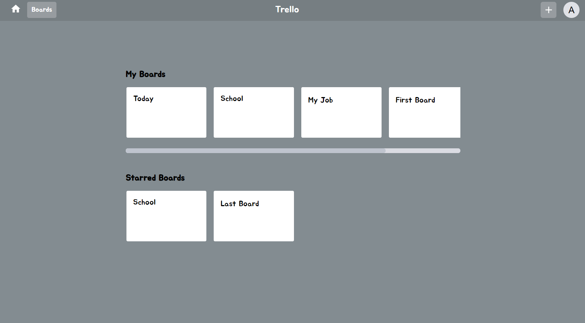

- Trello component는 루트 페이지로 접속시 보이는 페이지이다.
- 모든 Board를 볼 수 있으며, Starred 페이지도 따로 확인할 수 있다.

```tsx
const { boards } = useSelector<RootState, BoardState>(
  (state: RootState) => state.trello
);

const AllBoards = () => {
  return (
    <DivBoard>
      {boards.map((v, i) => (
        <DivBoardLink key={i} to={`/board/${v.id}`}>
          <DivBoardBox>{v.boardName}</DivBoardBox>
        </DivBoardLink>
      ))}
    </DivBoard>
  );
};

const StarBoards = () => {
  return (
    <DivBoard>
      {boards.map((v, i) => {
        if (v.star === true) {
          return (
            <DivBoardLink key={i} to={`/board/${v.id}`}>
              <DivBoardBox>{v.boardName}</DivBoardBox>
            </DivBoardLink>
          );
        } else {
          return null;
        }
      })}
    </DivBoard>
  );
};
```

<br />

### Navbar

- 모든 페이지에서 볼 수 있는 Navbar로 상단에 위치해 있다.
- 현재 Board들을 볼 수 있는 메인페이지로 이동할 수 있는 버튼과 새 Board를 생성할 수 있는 버튼이 있다.

<br />

### Board

- Trello 메인에서 하나의 Board를 클릭하면 볼 수 있는 페이지이다.
- trello의 기능인 List와 Card 관리가 가능하다.

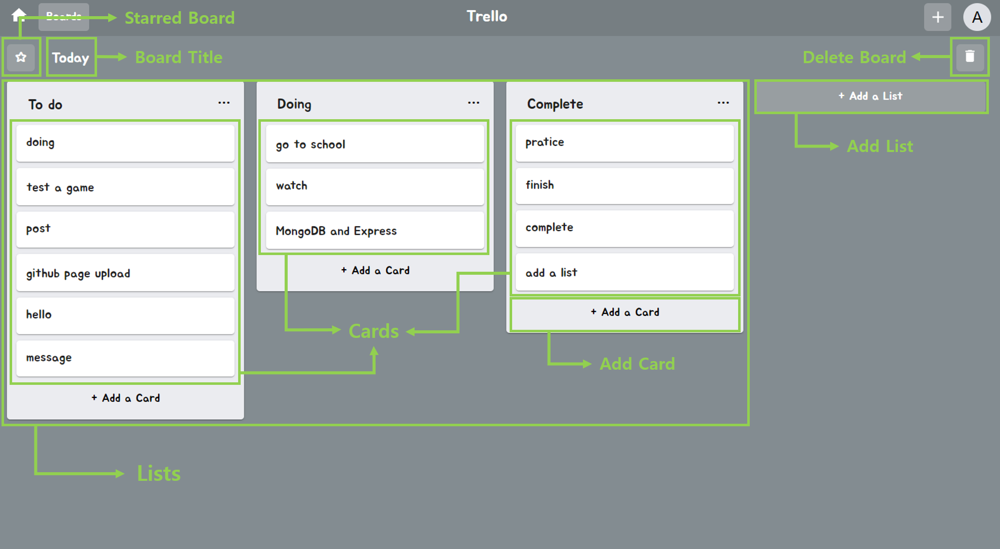
<br />

### BoardCreate

- 새로운 Board를 생성할 수 있다.

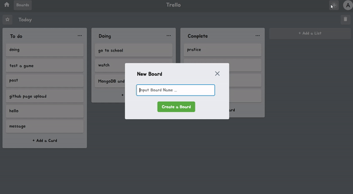

```tsx
const BoardCreate: React.FC<Props> = ({ setCreateBoard }) => {
  const history = useHistory();
  const dispatch = useDispatch();
  const { boardId } = useSelector<RootState, BoardState>(
    (state: RootState) => state.trello
  );

  const onClickAddBoard = () => {
    if (newBoard !== "") {
      onClickClose();
      dispatch(addBoard(newBoard));
      history.push(`/board/${boardId}`);
    }
  };

  return (
    <>
      <DivNewBoard>
        <CardNewBoard>
          <H3BoardTitle>New Board</H3BoardTitle>
          <InputNewBoard
            placeholder="Input Board Name ..."
            value={newBoard}
            onChange={onChangeBoard}
            maxLength={15}
            autoFocus
          />
          <ButtonNewBoard onClick={onClickAddBoard}>
            Create a Board
          </ButtonNewBoard>
          <CloseIconNewBoard onClick={onClickClose} />
        </CardNewBoard>
      </DivNewBoard>
    </>
  );
};
```

<br />

### BoardDelete

- 현재 Board를 삭제할 수 있다.

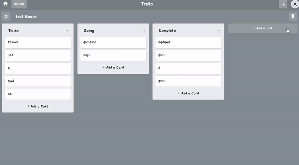

```tsx
const BoardDelete: React.FC<Props> = ({ boardId }) => {
  const history = useHistory();
  const dispatch = useDispatch();

  const [deleteBox, setDeleteBox] = useState(false);

  const onClickDeleteBoard = () => {
    dispatch(deleteBoard(boardId));
    history.push("/");
  };

  const DeleteButton = () => {
    return (
      <>
        <ButtonBoardDelete onClick={() => setDeleteBox(true)}>
          <DeleteIcon style={{ fontSize: "20px", color: "white" }} />
        </ButtonBoardDelete>
      </>
    );
  };
  const DeleteAction = () => {
    return (
      <>
        {DeleteButton()}
        <DivBoardDelete>
          <CardBoardDelete>
            <H3BoardDelete>Delete Board</H3BoardDelete>
            <PBoardDelete>삭제 후 되돌릴 수 없습니다.</PBoardDelete>
            <ButtonBoardDeleteDispatch onClick={onClickDeleteBoard}>
              Delete This Board
            </ButtonBoardDeleteDispatch>
            <CloseIconBoardDelete onClick={() => setDeleteBox(false)} />
          </CardBoardDelete>
        </DivBoardDelete>
      </>
    );
  };

  return deleteBox ? DeleteAction() : DeleteButton();
};
```

<br />

### BoardTitle

- 현재 Board의 Title를 변경할 수 있다.

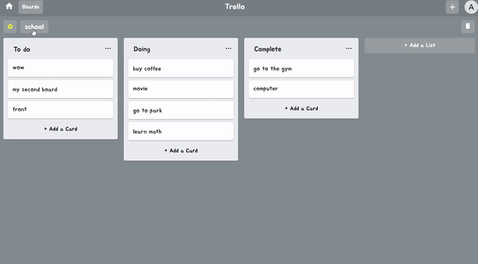

```tsx
const BoardTitle: React.FC<Props> = ({ boardName, boardId }) => {
  const dispatch = useDispatch();
  const [titleInput, setTitleInput] = useState(false);

  const onSubmitForm = (e: React.FormEvent<HTMLFormElement>) => {
    e.preventDefault();
    onBlurInput();
  };
  const onBlurInput = () => {
    if (boardText !== "") {
      dispatch(changeBoardName(boardText, boardId));
      setTitleInput(false);
    }
  };

  const BoardTitleText = () => {
    return (
      <TypographyBoardTitle variant="h6" onClick={() => setTitleInput(true)}>
        {boardName}
      </TypographyBoardTitle>
    );
  };
  const BoardTitleInput = () => {
    return (
      <FormBoardTitle onSubmit={onSubmitForm}>
        <InputBoardTitle
          value={boardText}
          onChange={onChangeName}
          onBlur={onBlurInput}
          maxLength={15}
          autoFocus
        />
      </FormBoardTitle>
    );
  };

  return titleInput ? BoardTitleInput() : BoardTitleText();
};
```

<br />

### BoardStar

- 현재 Board를 즐겨찾는 Board로 설정할 수 있다.

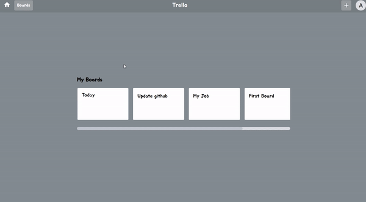

```tsx
const BoardStarButton: React.FC<Props> = ({ boardStar, boardId }) => {
  const dispatch = useDispatch();
  const onClickStar = () => {
    dispatch(starBoard(boardId));
  };

  const StarColor = boardStar ? "yellow" : "white";

  return (
    <ButtonStar style={{ color: StarColor }} onClick={onClickStar}>
      ☆
    </ButtonStar>
  );
};
```

<br />

### List

- 현재 Board에 있는 리스트들을 볼 수 있다.
- List Title 수정, List Action(Copy, Delete), List Add 등을 할 수 있다.

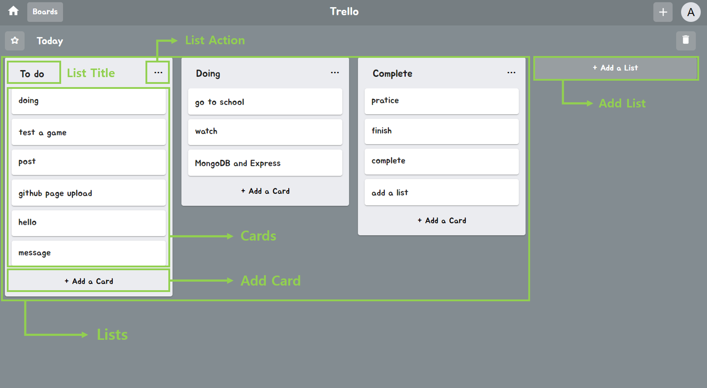
<br />

### ListTitle

- 해당 List의 Title을 변경할 수 있다.


```tsx
const ListTitle: React.FC<Props> = ({ title, index, boardId }) => {
  const dispatch = useDispatch();
  const [changeTitle, setChangeTitle] = useState(false);

  const onSubmitForm = (e: React.FormEvent<HTMLFormElement>) => {
    e.preventDefault();
    onBlurInput();
  };
  const onBlurInput = () => {
    if (textTitle !== "") {
      dispatch(changeListTitle(textTitle, index, boardId));
    }
    setChangeTitle(false);
  };

  const Title = () => {
    return (
      <CardHeaderTitle title={title} disableTypography onClick={onClickTitle} />
    );
  };
  const TitleForm = () => {
    return (
      <form onSubmit={onSubmitForm}>
        <InputTitle
          value={textTitle}
          onChange={onChangeInput}
          onBlur={onBlurInput}
          maxLength={15}
          autoFocus
        />
      </form>
    );
  };

  return changeTitle ? TitleForm() : Title();
};
```

<br />

### ListAction

- 해당 List Action(Add Card, Copy List, Delete List)를 할 수 있다.

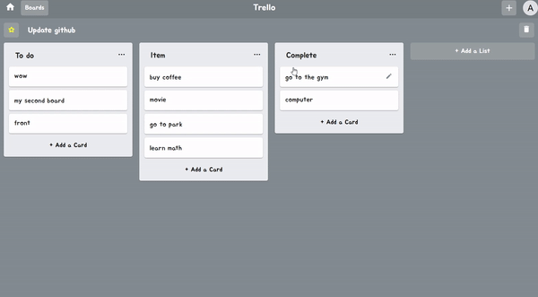

```tsx
const ListAction: React.FC<Props> = ({ setActionOpen, index, boardId }) => {
  const dispatch = useDispatch();

  const onClickAddList = () => {
    if (newList !== "") {
      onClickListAcClose();
      dispatch(copyList(newList, index, boardId));
      setNewList("");
    }
  };
  const onClickDeleteList = () => {
    onClickListAcClose();
    dispatch(deleteList(index, boardId));
  };

  const ActionHome = () => {
    return (
      <DivActionBt>
        <ButtonListAc onClick={onClickListAcAddCard} disableRipple>
          Add Card
        </ButtonListAc>
        <ButtonListAc onClick={onClickListAcCopy} disableRipple>
          Copy List
        </ButtonListAc>
        <ButtonListAc onClick={onClickListAcDelete} disableRipple>
          Delete This List
        </ButtonListAc>
      </DivActionBt>
    );
  };
  const ListCopy = () => {
    return (
      <DivAction>
        <p>Name</p>
        <InputCopy
          placeholder="Input List title ..."
          value={newList}
          onChange={onChangeList}
          maxLength={15}
          autoFocus
        />
        <ButtonCopyAc onClick={onClickAddList}>Create</ButtonCopyAc>
      </DivAction>
    );
  };
  const ListDelete = () => {
    return (
      <DivAction>
        <PDelete>삭제 후 되돌릴 수 없습니다.</PDelete>
        <ButtonDeleteAc onClick={onClickDeleteList}>Delete</ButtonDeleteAc>
      </DivAction>
    );
  };

  const ActionTitle = copyAction
    ? "Copy List"
    : deleteAction
    ? "Delete List"
    : "List Actions";

  return (
    <>
      <PaperListAc onMouseLeave={onClickListAcClose}>
        <TypographyListAc variant="subtitle1">{ActionTitle}</TypographyListAc>
        <CloseIconListAc onClick={onClickListAcClose} />
        <HrListAc />
        {copyAction ? ListCopy() : deleteAction ? ListDelete() : ActionHome()}
      </PaperListAc>
    </>
  );
};
```

<br />

### ListCardAdd

- List와 Card 를 추가할 수 있다.
- Add List와 Add Card의 Form이 같기 때문에 한 컴포넌트로 만들어 주었다.

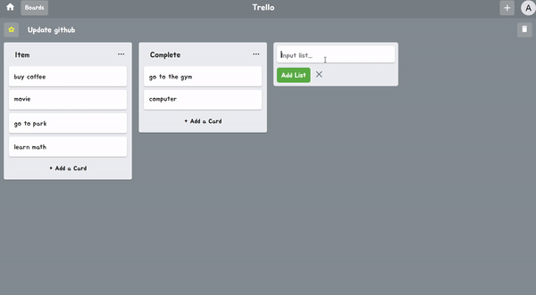

```tsx
const ListCardAdd: React.FC<Props> = ({ list, index, boardId }) => {
  const dispatch = useDispatch();
  const [addInput, setaddInput] = useState(false);
  const [text, setText] = useState("");
  const inputEl = useRef<HTMLTextAreaElement>(null);

  const onClickAddCard = () => {
    if (text !== "") {
      if (list) {
        dispatch(addList(text, boardId));
        onClickClose();
      } else {
        dispatch(addCard(text, index, boardId));
      }
      setText("");
    }
    if (inputEl.current) {
      inputEl.current.focus();
    }
  };

  const placeholder = list ? "Input list..." : "Input card...";
  const buttonValue = list ? "+ Add a List" : "+ Add a Card";
  const AddButtonValue = list ? "Add List" : "Add Card";
  const buttonValueColor = list ? "white" : "black";
  const BackgroundColor = list ? "rgb(235,236,240)" : "inherit";
  const InputHeight = list ? "20px" : "60px";

  const AddButton = () => {
    return (
      <ButtonLCAc
        mycolor={buttonValueColor}
        onClick={onClickOpen}
        disableRipple
      >
        {buttonValue}
      </ButtonLCAc>
    );
  };
  const AddInput = () => {
    return (
      <DivBackGroundColor backgroundColor={BackgroundColor}>
        <TextareaLCAc
          height={InputHeight}
          ref={inputEl}
          placeholder={placeholder}
          value={text}
          onChange={onChangeCard}
          autoFocus
        />
        <ButtonAddLCAc onClick={onClickAddCard}>{AddButtonValue}</ButtonAddLCAc>
        <CloseIconLCAc onClick={onClickClose} />
      </DivBackGroundColor>
    );
  };

  return addInput ? AddInput() : AddButton();
};
```

<br />

### Card

- 해당 List에 있는 Card들을 볼 수 있다.
- Drag & Drop을 통한 Card 이동, Card Content 수정, Card Delete, Card Add를 할 수 있다.

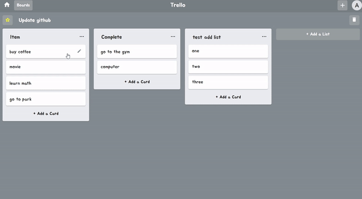

<br />

### CardContent

- 해당 Card를 Edit, Delete 할 수 있다.

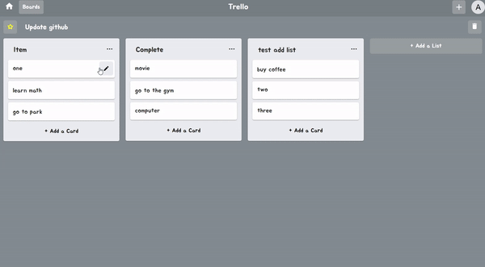

```tsx
const CardContent: React.FC<Props> = ({
  edit,
  setCardEditBox,
  list,
  index,
  listIndex,
  boardId,
}) => {
  const dispatch = useDispatch();

  const onClickSave = () => {
    if (editList !== "") {
      dispatch(editCard(editList, index, listIndex, boardId));
    }
    onClickEditClose();
  };
  const onClickDelete = () => {
    dispatch(deleteCard(index, listIndex, boardId));
    onClickEditClose();
  };

  const ContentCard = () => {
    return (
      <PaperCardContent>
        <PListText>{list}</PListText>
        <CreateIconCardContent onClick={onClickEditOpen} />
      </PaperCardContent>
    );
  };
  const EditCard = () => {
    return (
      <>
        <DivBlack onClick={onClickEditClose}></DivBlack>
        <DivEmptyBox></DivEmptyBox>
        <TextareaCardContent
          placeholder="Input card ..."
          value={editList}
          onChange={onChangeEditList}
          autoFocus
        />
        <CloseIconCardContent onClick={onClickEditClose} />
        <ButtonCardEdit onClick={onClickSave}>Save</ButtonCardEdit>
        <ButtonCardDelete onClick={onClickDelete}>Delete</ButtonCardDelete>
      </>
    );
  };

  return edit ? EditCard() : ContentCard();
};
```
